<div align="center">

# 📸 PrintfY

### AI-Powered Passport &amp; ID Photos — in 60 Seconds, for Free

Upload one photo. PrintfY removes the background, enhances quality, crops to an exact
passport/ID spec, and hands you a ready-to-print sheet of 6, 8 or 12 photos — no studio,
no Photoshop, no cost.

[](https://printify-neon.vercel.app/)
&nbsp;
[](https://nextjs.org)
[](https://react.dev)
[](https://www.typescriptlang.org)
[](https://tailwindcss.com)

</div>

---

## 🎬 Watch it in action

<div align="center">

<video
  src="https://github.com/SagarSuryakantWaghmare/printify/raw/main/docs/video/printfy-walkthrough.mp4"
  poster="https://github.com/SagarSuryakantWaghmare/printify/raw/main/docs/video/printfy-walkthrough-poster.png"
  controls
  muted
  width="860">
</video>

<br/>

**▶︎ [Watch / download the 1080p walkthrough (32 s)](docs/video/printfy-walkthrough.mp4)** &nbsp;·&nbsp; **[Open the live app ↗](https://printify-neon.vercel.app/)**

<sub>The inline player renders on the project's <code>main</code> README. From a fork or PR branch, use the download link above.</sub>

</div>

> The clip walks the full journey end-to-end: landing page → sign in → pick a passport spec →
> upload a photo → AI background removal → crop &amp; align → enhanced, print-ready sheet.

---

## ✨ What is PrintfY?

Getting passport photos in India usually means a trip to a studio and **₹50–₹150 per print**.
PrintfY replaces that with a guided web app that does the whole job in your browser in about a minute —
and it's **100% free**.

- 🎯 **Built for India first** — defaults to the Indian passport spec (35 × 45 mm), with professional (51 × 51 mm) and fully custom sizes.
- 🧠 **AI does the hard part** — background removal, smart enhancement and face-aware cropping.
- 🖨️ **Print-ready output** — lays photos out on a 4×6″ or A4 sheet with trim guides, as JPG or PDF.
- 🔒 **Privacy-respecting** — the photo only ever leaves the browser for background removal (over HTTPS, never stored); cropping, enhancement and export all run locally.
- 📴 **Installable PWA** — works as an app with offline shell + service worker.

---

## 🖼️ Screenshots

> Full-resolution captures live in [`docs/screenshots/`](docs/screenshots).

### Landing page

| Hero | How it works |
| :--: | :--: |
| [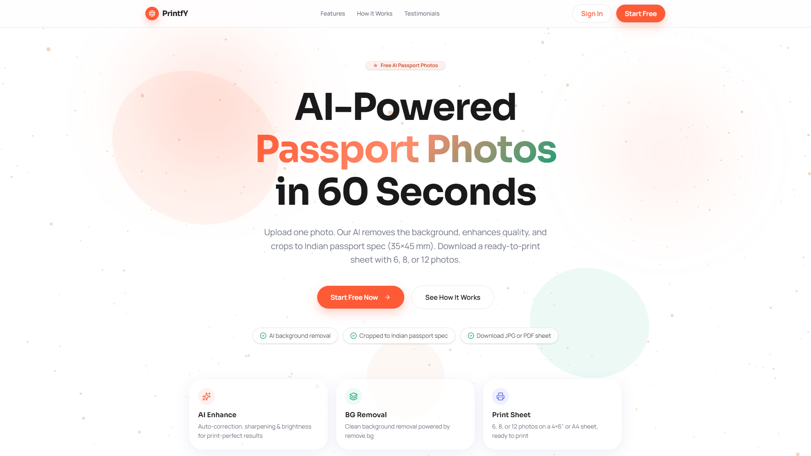](docs/screenshots/01-landing-hero.png) | [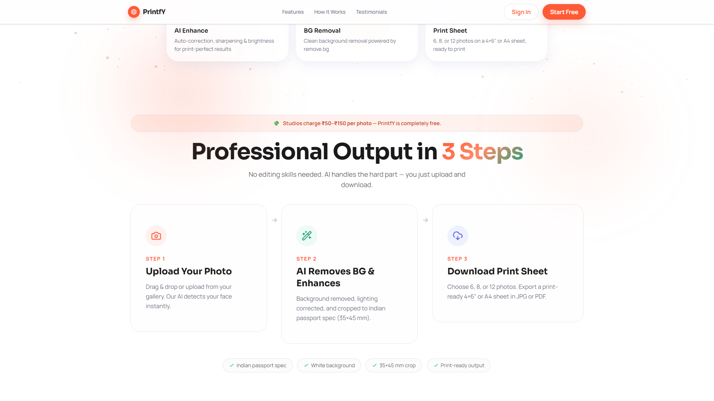](docs/screenshots/02-landing-how-it-works.png) |
| **AI transformation / why PrintfY** | **Pricing — everything free** |
| [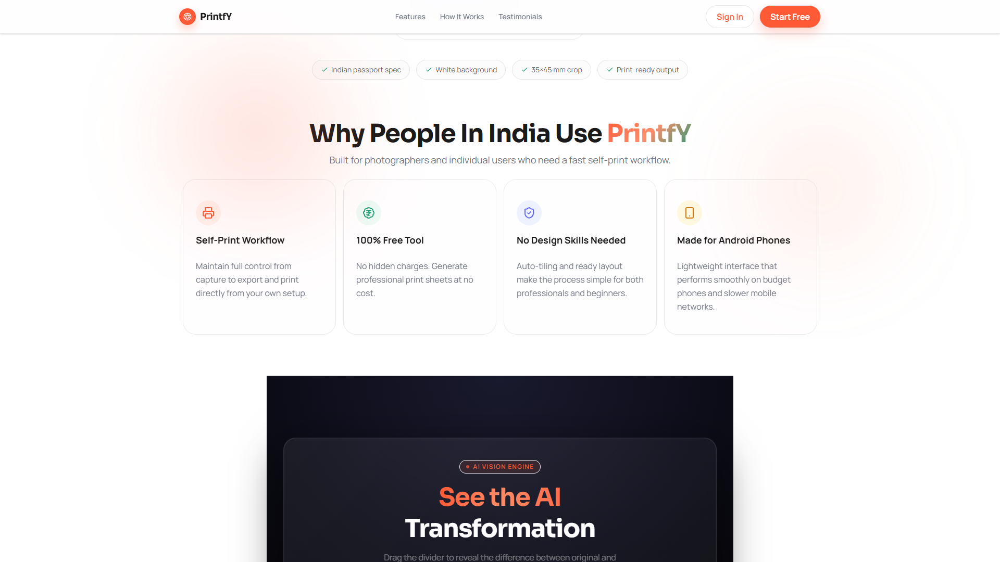](docs/screenshots/03-landing-before-after.png) | [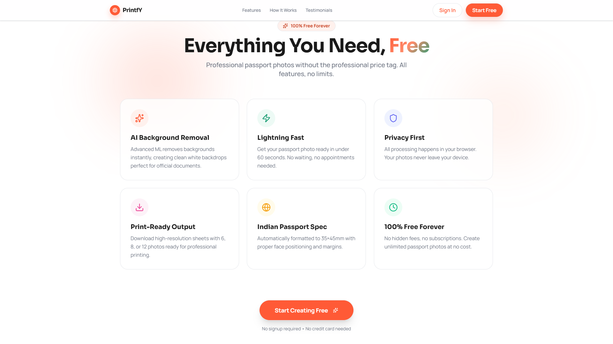](docs/screenshots/04-landing-pricing.png) |

### The app — 4-step wizard

| 1 · Upload &amp; configure | 2 · AI background removal |
| :--: | :--: |
| [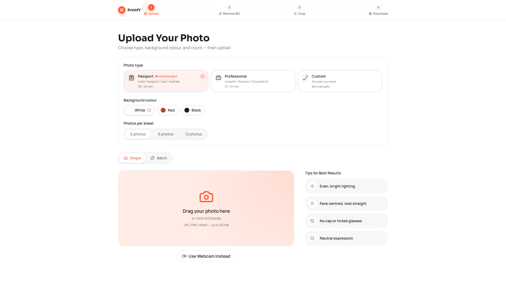](docs/screenshots/05-wizard-capture.png) | [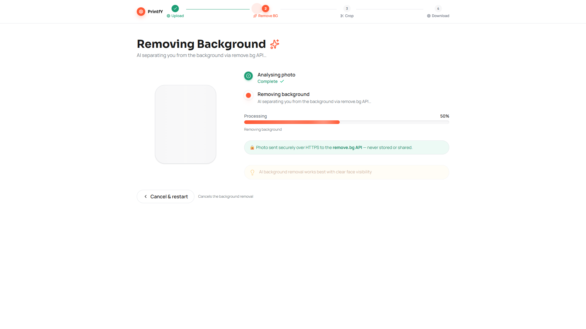](docs/screenshots/07-wizard-processing.png) |
| **3 · Crop &amp; align** | **4 · Enhanced, print-ready sheet** |
| [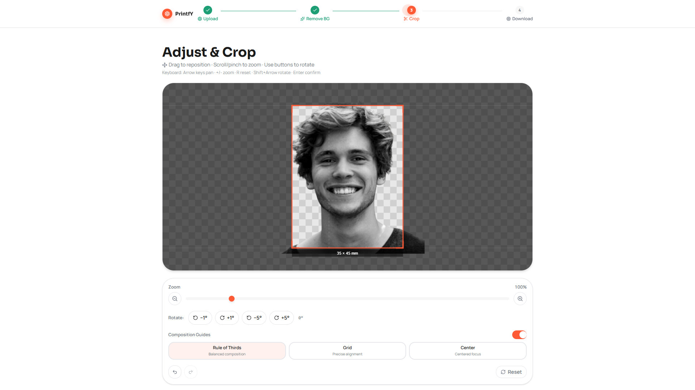](docs/screenshots/08-wizard-crop.png) | [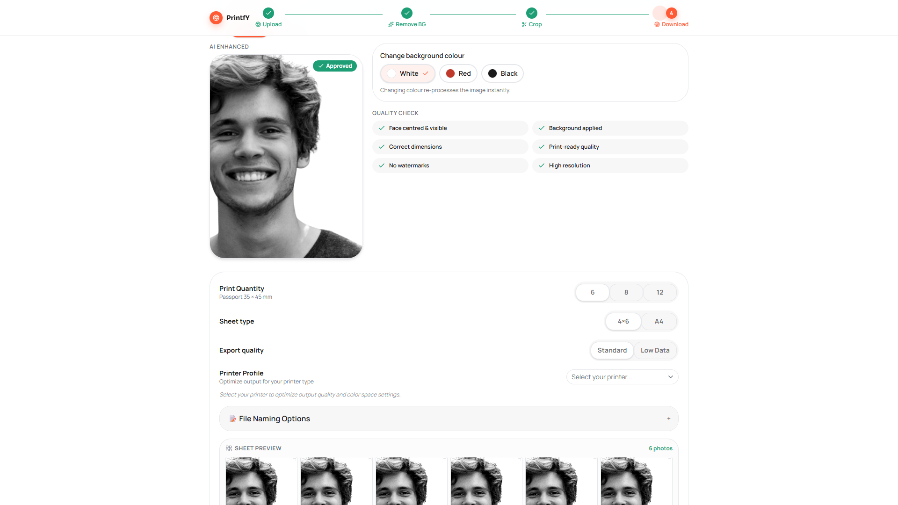](docs/screenshots/09-wizard-preview.png) |

---

## 🚀 Features

| Area | What you get |
| --- | --- |
| **Capture** | Drag-and-drop, file browse, **webcam capture**, or **batch** multi-file upload. Recent-photo history (localStorage). 20 MB limit, JPG/PNG/WebP. |
| **Photo specs** | Indian passport **35 × 45 mm**, professional **51 × 51 mm**, or custom millimetre dimensions. White / red / black backgrounds. 6, 8 or 12 per sheet. |
| **AI background removal** | One-click person cut-out via the remove.bg API, returned as a transparent PNG. |
| **Crop studio** | Canvas editor with drag-to-pan, scroll/pinch zoom, fine rotation, rule-of-thirds / grid / center guides, **undo / redo**, and full keyboard control. |
| **Enhancement** | Client-side sharpen + contrast on export; optional server-side Cloudinary auto-improve and Hugging Face super-resolution. |
| **Output** | Print sheets on 4×6″ or A4 with corner trim marks. Download **JPG** or **PDF**, configurable file-naming, printer profiles, and native share. |
| **Polish** | Animated, accessible UI (Radix + framer-motion), 3D hero background (three.js), toast system, skip-to-content, installable PWA. |

---

## 🔄 How it works

A guided four-step state machine — upload once, download a sheet. Every step is non-destructive,
so you can step back without losing your photo or edits.

<div align="center">

[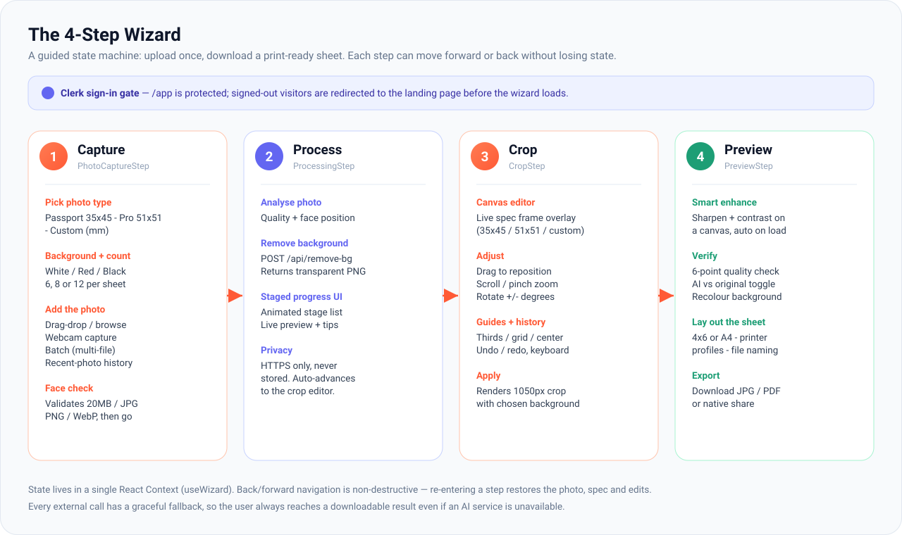](docs/diagrams/wizard-flow.svg)

</div>

---

## 🏗️ Architecture

The client does as much as possible in-browser; the Next.js server only brokers the three AI
services and keeps every secret server-side. Each route **degrades gracefully** — on any error
it returns the original image so the user is never blocked.

<div align="center">

[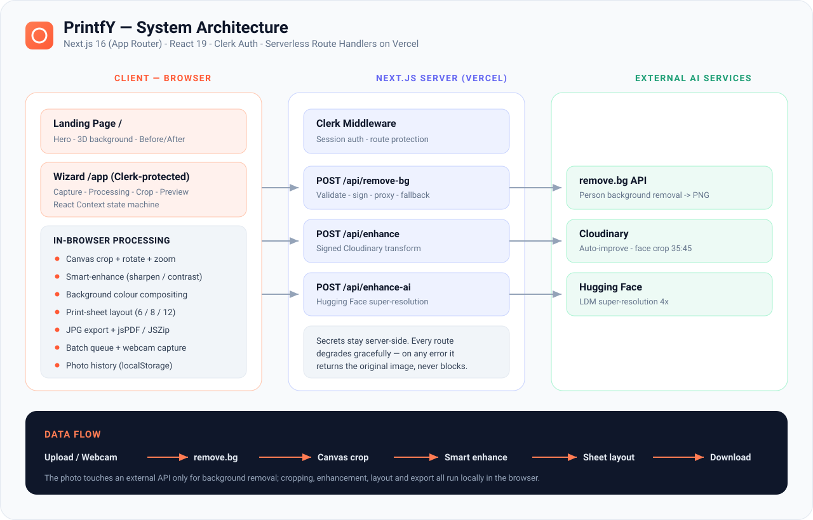](docs/diagrams/architecture.svg)

</div>

---

## 🔌 API reference

Three serverless route handlers under `app/api/`. All accept a JSON body
`{ "imageDataUrl": "data:image/...;base64,..." }` and return `{ resultDataUrl, fallback }`.

| Route | Method | Provider | Purpose | If unconfigured / on error |
| --- | :--: | --- | --- | --- |
| `/api/remove-bg` | `POST` | [remove.bg](https://www.remove.bg/api) | Removes the background → transparent PNG | Returns the original image with `fallback: true` |
| `/api/enhance` | `POST` | [Cloudinary](https://cloudinary.com) | Signed auto-improve, sharpen &amp; face-aware 35:45 crop | Returns the original image |
| `/api/enhance-ai` | `POST` | [Hugging Face](https://huggingface.co) | LDM 4× super-resolution sharpening | Returns the original (handles cold-start 503) |

**Request lifecycle** — validate input → keep the API key server-side → call the provider with a
timeout → always return a usable image:

<div align="center">

[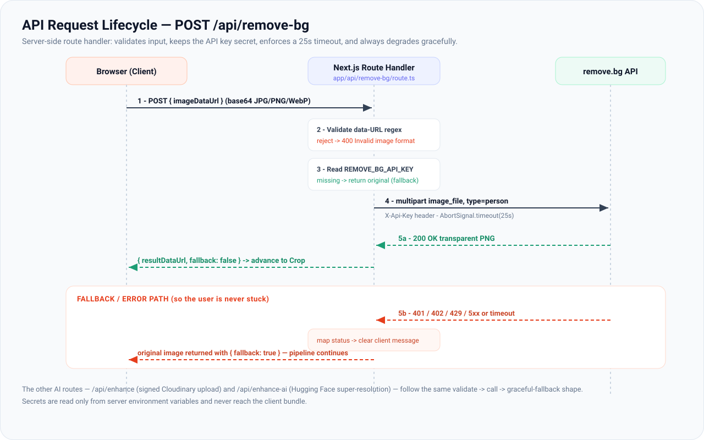](docs/diagrams/api-sequence.svg)

</div>

```bash
# Example: background removal
curl -X POST https://printify-neon.vercel.app/api/remove-bg \
  -H "Content-Type: application/json" \
  -d '{ "imageDataUrl": "data:image/png;base64,iVBORw0KGgo..." }'
```

---

## 🧰 Tech stack

- **Framework:** Next.js 16 (App Router, Turbopack, Route Handlers) · React 19 · TypeScript 5
- **Styling:** Tailwind CSS v4 · Radix UI / shadcn primitives · `class-variance-authority`
- **Auth:** Clerk (`@clerk/nextjs`, middleware via `proxy.ts`)
- **Motion &amp; 3D:** framer-motion · three.js + `@react-three/fiber` + `drei`
- **Imaging:** HTML Canvas · `jspdf` · `jszip` · `img-comparison-slider` · lucide-react icons
- **AI services:** remove.bg · Cloudinary · Hugging Face Inference API
- **Hosting:** Vercel

---

## 📁 Project structure

```
printify/
├── app/
│   ├── page.tsx              # Landing page
│   ├── app/page.tsx          # The wizard (Clerk-protected)
│   ├── layout.tsx            # Root layout, ClerkProvider, fonts
│   └── api/
│       ├── remove-bg/        # remove.bg proxy
│       ├── enhance/          # Cloudinary enhance
│       └── enhance-ai/       # Hugging Face super-resolution
├── components/
│   ├── landing/              # Hero, pricing, before/after, 3D bg…
│   ├── wizard/               # Capture, Processing, Crop, Preview steps
│   ├── common/               # Navbar, footer, toasts, a11y
│   └── ui/                   # Buttons, dialogs, tabs… (design system)
├── lib/                      # Hooks, image processing, sheet export, helpers
├── proxy.ts                  # Clerk middleware (Next.js 16 naming)
├── docs/                     # README media — see below
└── public/                   # PWA manifest, service worker, assets
```

---

## 🛠️ Getting started

> **Prerequisites:** Node.js 20+ and npm.

```bash
# 1. Clone
git clone https://github.com/SagarSuryakantWaghmare/printify.git
cd printify

# 2. Install
npm install

# 3. Configure environment
cp .env.example .env.local      # then fill in your keys

# 4. Run the dev server
npm run dev                     # http://localhost:3000
```

Other scripts: `npm run build` (production build) · `npm run start` (serve the build) · `npm run lint`.

### Environment variables

| Variable | Required | Purpose |
| --- | :--: | --- |
| `NEXT_PUBLIC_CLERK_PUBLISHABLE_KEY` | ✅ | Clerk publishable key (client) |
| `CLERK_SECRET_KEY` | ✅ | Clerk secret key (server) |
| `REMOVE_BG_API_KEY` | ⬜ | remove.bg background removal |
| `CLOUDINARY_CLOUD_NAME` · `CLOUDINARY_API_KEY` · `CLOUDINARY_API_SECRET` | ⬜ | Cloudinary enhancement |
| `HF_API_TOKEN` | ⬜ | Hugging Face super-resolution |

The optional keys are **graceful** — without them the AI steps simply pass the original image
through, so the app still runs end-to-end. See [`CLERK_SETUP.md`](CLERK_SETUP.md) for Clerk setup.

---

## ☁️ Deployment

Deployed on **[Vercel](https://printify-neon.vercel.app/)**. To deploy your own:

1. Import the repository into Vercel.
2. Add the environment variables above in **Project → Settings → Environment Variables**.
3. Deploy — Vercel auto-detects Next.js. No extra build configuration needed.

---

## 🗂️ Repository media

Every asset referenced above is committed under `docs/`:

| Path | Contents |
| --- | --- |
| **`docs/video/printfy-walkthrough.mp4`** | 🎬 The 1080p, 32-second product walkthrough (shown at the top). |
| `docs/video/printfy-walkthrough-poster.png` | Poster / thumbnail frame for the video. |
| **`docs/screenshots/`** | `01–04` landing-page captures, `05–10` in-app wizard captures (1920×1080 PNG). |
| **`docs/diagrams/`** | `architecture.svg`, `wizard-flow.svg`, `api-sequence.svg`. |

---

## 📄 License

This project does not yet declare an open-source license — © 2026 Sagar Suryakant Waghmare.
All rights reserved until a license file is added. For reuse, please open an issue.

<div align="center">

Made with ❤️ for everyone who's tired of overpriced passport photos.

**[Try PrintfY free ↗](https://printify-neon.vercel.app/)**

</div>
